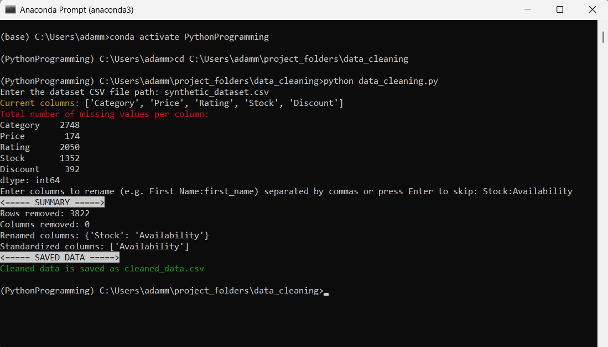
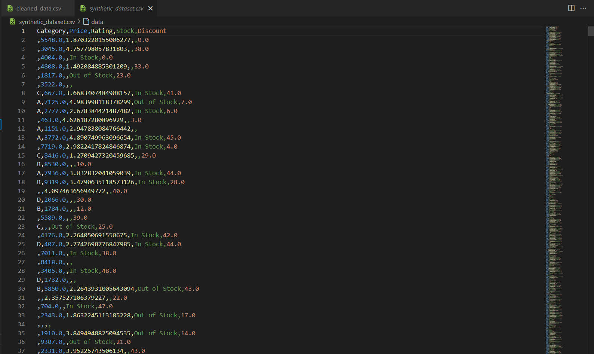
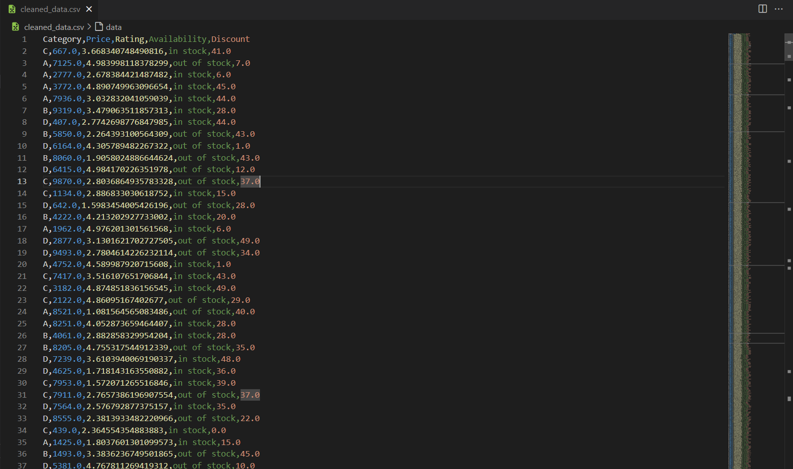

# Data Cleaning Tool 

This script loads a CSV dataset with pandas, removes rows or columns containing missing values, allows the user to rename columns and standardizes text formatting in the renamed columns. After cleaning the data, this tool generates a summary report of changes and saves the cleaned dataset to `cleaned_data.csv`.

## ⚙️ Requirements
- Python 3.x
- pandas
- colorama

## 💻 Tech Stack
- Python
- pandas


## 🚀 Getting Started

Follow these steps to download and run the program:

1. Clone the repo or click the green **Code** button, then select **Download ZIP** to download the repository
2. Extract the zip file to a folder on your computer
3. Open Terminal (macOS/Linux) or Command Prompt/Anaconda Prompt (Windows)
4. Navigate to the folder:
`cd path/to/project`
5. Install dependencies:
```
pip install -r requirements.txt
```
6. Run the script:
```
python data_cleaning.py
```
7. Provide:
   - Path to the CSV file (e.g., `sample_data.csv`)
   - (Optional) Rename columns in the format `OldName:NewName`, separated by commas.

## 📸 Example








## 📄 License

This project is licensed under the [MIT License](/LICENSE).
